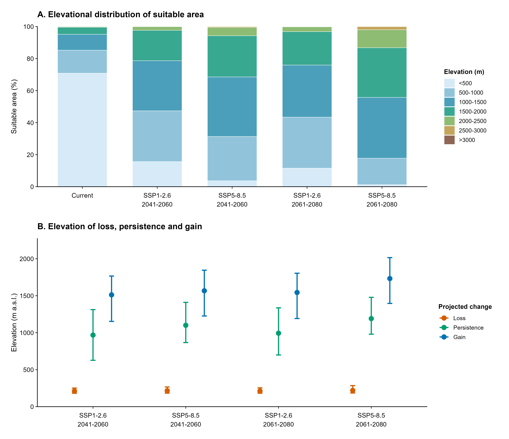

# Elevational redistribution — Figure 6

We present our publication figure for the *Stenochrus portoricensis* climatic-suitability manuscript.

[Open our Figure 6 PNG](Figure_altitudinal_redistribution_FINAL.png)

We depict (A) area-weighted percentages of current and future suitable climates across elevation bands, and (B) area-weighted median elevations and interquartile ranges for climatic-suitability loss, persistence and gain. We provide the numerical outputs and reproducibility resources in [results/altitude](../../results/altitude), [R/12_altitudinal_analysis.R](../../R/12_altitudinal_analysis.R) and [R/13_altitudinal_figure.R](../../R/13_altitudinal_figure.R).

We exported the deposited figure at high resolution from RStudio and document its caption in [docs/elevational_redistribution.md](../../docs/elevational_redistribution.md). We distinguish the deposited PNG from the original local TIFF/PDF export formats.
